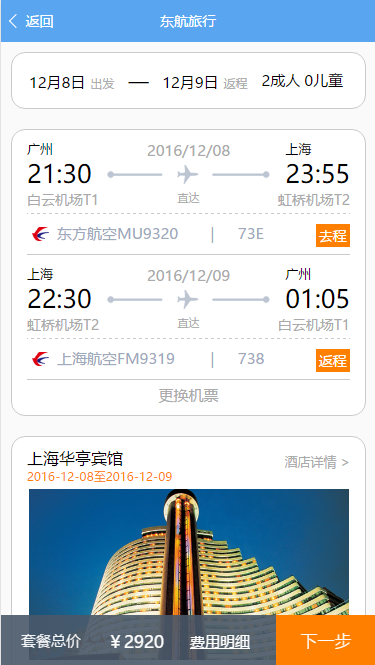

## 项目介绍
### 这是东航电商的东航旅行的完整项目，很荣幸作为第一批吃螃蟹的人。

## 目录结构
```
  less                        --> less文件目录
  scripts                     --> 微信小程序不支持的，需要打包的pollyfill文件
  node_modules                --> npm安装目录
  src/                        --> 微信小程序的源代码
  webpack.config.js           --> webpack的配置文件
  package.json                --> npm的配置文件
```

## 下载依赖包
```
npm install
```

## 监听webpack
```
npm run webpack:w
```

## 功能介绍
 - 预订酒店
 - 预订机票
 - 下单
 - 添加乘客
 - 订单列表
 - 订单详情

## 项目中截图




## external link
[liveportraitweb](https://www.liveportraitweb.com/)
[novelling](https://www.novelling.com/)
[whatnovel](https://whatnovel.com/)
[omniparser](https://www.omniparser.net/)
[sexting](https://howtosexting.com/)
[Comprimirmp4](https://www.comprimirmp4.com/)
[Rewritifyai](https://www.rewritifyai.com/)
[Sprunki Phase 5](https://www.sprunkiphase5.net/)
[MMAudio](https://www.mmaudio.pro/)
[Creator Viral Video](https://www.creatorviralvideo.com/)
[Transpixar](https://www.transpixar.pro/)
[Flexvalorant](https://www.flexvalorant.com)
[Rednote](https://www.rednote.pro/)
[RednoteUS](https://www.rednote.us/)
[Body Visualizer](https://www.bodyvisualizer.org/)
[AI Kungfu](https://www.ai-kungfu.net/)
[Deepseek Image](https://deepseekimage.net/)
[10minutes.one](https://10minutes.one/)
